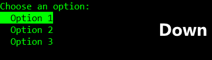
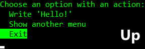

# Simple Console Menus

Use the up and down arrow keys to navigate and the ENTER key to select.

## Simple Console Menu Example

### Using

```cs
using YonatanMankovich.SimpleConsoleMenus;
```

### Adding Menu Options

#### Manually

```cs
SimpleConsoleMenu menu = new SimpleConsoleMenu("Choose an option:");
menu.AddOption("Option 1").AddOption("Option 2").AddOption("Option 3");
```

#### Using `params`

```cs
SimpleConsoleMenu menu = new SimpleConsoleMenu("Choose an option:", "Option 1", "Option 2", "Option 3");
```

#### Using `IEnumerable`

```cs
IEnumerable<string> options = new List<string>() { "Option 1", "Option 2", "Option 3" };
SimpleConsoleMenu menu = new SimpleConsoleMenu("Choose an option:", options);
```

### Getting Results

```cs
menu.Show();
int selectedIndex = menu.SelectedIndex;
string selectedItemName = menu.GetSelectedItemName();
Console.WriteLine($"You selected index {selectedIndex} which is '{selectedItemName}'");
```



---

## Simple *Action* Console Menu Example

```cs
SimpleActionConsoleMenu menu = new SimpleActionConsoleMenu("Choose an option with an action:");
menu.AddOption("Write 'Hello!'", () => Console.WriteLine("Hello!"))
    .AddOption("Show another menu", TestSimpleConsoleMenu)
    .AddOption("Exit", () => Environment.Exit(0))
    .ShowAndDoAction();
```



## My Other Projects That Use This Library

[Command Line Synonyms Practice Tool](https://github.com/yonimn2000/command-line-synonyms-practice-tool)

[Command Line Battleship Game](https://github.com/yonimn2000/command-line-battleship-v2)

[Command Line Snake](https://github.com/yonimn2000/command-line-snake)

[Command Line Minesweeper](https://github.com/yonimn2000/command-line-minesweeper)

[System Specs Scraper](https://github.com/yonimn2000/system-specs-scraper)
