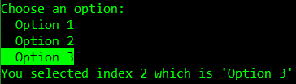

# Simple Console Menu

Use up and down arrow keys to navigate and ENTER key to select.

## Simple Console Menu Example

### Adding Menu Options

#### Manually
```cs
SimpleConsoleMenu menu = new SimpleConsoleMenu("Choose an option:");
menu.AddOption("Option 1");
menu.AddOption("Option 2");
menu.AddOption("Option 3");
```
#### Using `params`

```cs
SimpleConsoleMenu menu = new SimpleConsoleMenu("Choose an option:", "Option 1", "Option 2", "Option 3");
```

#### Using `IEnumerable`

```cs
IEnumerable<string> options = new List<string>() { "Option 1", "Option 2", "Option 3" };
SimpleConsoleMenu menu = new SimpleConsoleMenu("Choose an option:", options);
```

### Getting Results

```cs
menu.Show();
int selectedIndex = menu.SelectedIndex;
string selectedItemName = menu.GetSelectedItemName();
Console.WriteLine($"You selected index {selectedIndex} which is '{selectedItemName}'");
```



---
## Simple *Action* Console Menu Example

```cs
SimpleActionConsoleMenu menu = new SimpleActionConsoleMenu("Choose an option with an action:");
menu.AddOption("Write 'Hello!'", () => Console.WriteLine("Hello!"));
menu.AddOption("Show another menu", TestSimpleConsoleMenu);
menu.AddOption("Exit", () => Environment.Exit(0));
menu.ShowAndDoAction();
```

